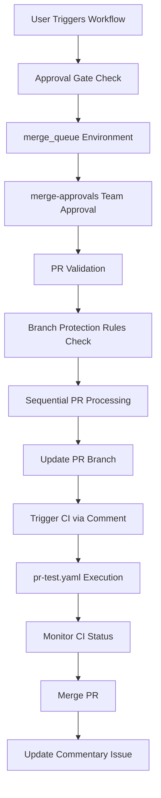

# Automated PR Merge Queue Drainer Documentation

## Overview

The **Merge Queue Drainer** (`automated_pr_merge.yaml`) is a sophisticated GitHub Actions workflow that automates the validation and sequential merging of multiple pull requests into your repository's default branch. This workflow acts as a "merge queue drainer" by processing batches of PRs in a controlled, validated manner.

## Key Features

- **🔒 Manual Approval Gate**: Requires approval from designated team members before execution
- **📊 Sequential PR Processing**: Processes PRs in chronological order (lowest PR number first)
- **🧪 Automated CI Testing**: Triggers and monitors CI tests for each PR before merging
- **🚀 Release Branch Support**: Optional support for merging release branches first
- **✅ Comprehensive Validation**: Validates PR status, approvals, conflicts, and branch protection compliance
- **📈 Detailed Reporting**: Provides comprehensive summary with categorized results
- **🔄 Intelligent Branch Management**: Automatically updates PR branches and handles merge conflicts
- **⏱️ Configurable Timeouts**: Flexible timeout settings for CI execution and startup phases

## Prerequisites and Setup

The Merge Queue Drainer requires several components to be configured before it can be used. Follow these steps in order to set up the complete system.

### 1. Create a Fine-Grained Personal Access Token

The workflow requires a special token to trigger CI workflows, as GitHub's default `GITHUB_TOKEN` cannot trigger other workflows via comments due to security restrictions.

**Steps to create the token:**

1. Go to **GitHub Settings** → **Developer settings** → **Personal access tokens** → **Fine-grained tokens**
2. Click **"Generate new token"**
3. Configure the token with the following settings:
   - **Token name**: `CI Trigger Token` (or similar descriptive name)
   - **Expiration**: Set according to your organization's security policy (recommended: 90 days or less)
   - **Repository access**: Select the specific repository or repositories where this workflow will be used
   - **Repository permissions**:
     - **Administration**: **Read** access (required to read branch protection rules)
     - **Code**: **Read and Write** access (required for branch operations)
     - **Metadata**: **Read** access (required for basic repository information)
     - **Pull requests**: **Read and Write** access (required to comment on PRs and trigger workflows)

4. Click **"Generate token"** and **copy the token value securely**

⚠️ **Important**: Store this token securely as it will only be displayed once. You'll need it for the repository secret in step 4.

### 2. Create the Merge Approvals Team

The workflow uses GitHub Teams to control who can approve and execute merge operations.

**Steps to create the team:**

1. Go to your **GitHub organization settings**
2. Navigate to **Teams**
3. Click **"New team"**
4. Configure the team:
   - **Team name**: `merge-approvals`
   - **Description**: `Team authorized to approve and execute automated PR merges`
   - **Visibility**: Choose based on your organization's policy (typically "Visible" for transparency)
5. Add team members:
   - Add all backend SPOCs (Subject Matter Point of Contacts) who should have approval rights
   - Add senior developers or team leads who are authorized to execute merge operations
   - Ensure all team members have appropriate repository access (at minimum: Write access)

**Team member requirements:**
- Must have Write or Admin access to the repository
- Should be familiar with the codebase and merge policies
- Should understand the impact of batch merging operations

### 3. Create the Merge Queue Environment

GitHub Environments provide the approval gate mechanism that ensures only authorized team members can execute the merge workflow.

**Steps to create the environment:**

1. Go to your **repository Settings** → **Environments**
2. Click **"New environment"**
3. **Environment name**: `merge_queue`
4. Configure the environment settings:

   **Required reviewers:**
   - ✅ Enable **"Required reviewers"**
   - Click **"Add reviewers"** and select the `merge-approvals` team created in step 2
   - Set **"Required number of reviewers"**: `1` (or higher based on your organization's policy)

   **Deployment branches and tags:**
   - Select **"Protected branches only"**
   - This ensures the workflow can only be triggered from protected branches
   - Verify your default branch (e.g., `master` or `main`) appears in the protected branches list

   **Wait timer (optional):**
   - Leave at `0` minutes unless you want an additional delay before approval

5. Click **"Save protection rules"**

**Important notes:**
- The environment name `merge_queue` is hardcoded in the workflow and must match exactly
- Only members of the `merge-approvals` team will be able to approve workflow executions
- The workflow will pause at the approval gate until a team member manually approves it

### 4. Add Repository Secret

The fine-grained personal access token must be stored as a repository secret for the workflow to access it securely.

**Steps to add the secret:**

1. Go to your **repository Settings** → **Secrets and variables** → **Actions**
2. Click **"New repository secret"**
3. Configure the secret:
   - **Name**: `CI_TRIGGER_TOKEN` (must match exactly - this name is hardcoded in the workflow)
   - **Secret**: Paste the fine-grained personal access token created in step 1
4. Click **"Add secret"**

**Security considerations:**
- This secret will be accessible to all workflows in the repository
- Only repository administrators can view or modify secrets
- The token should be rotated periodically according to your security policy
- Monitor the token's usage through GitHub's audit logs

### 5. Ensure Supporting Workflows Are Present

The Merge Queue Drainer depends on the **PR Test Runner** workflow to execute CI tests.

**Required workflow file:** `.github/workflows/pr-test.yaml`

This workflow should:
- Trigger on `issue_comment` events with "Ok to test" comments
- Execute your project's test suite (Maven, npm, etc.)
- Set commit status to success/failure
- Comment on PRs with test results

**Verification steps:**
1. Check that `.github/workflows/pr-test.yaml` exists in your repository
2. Verify it triggers on "Ok to test" comments
3. Test it manually by commenting "Ok to test" on a test PR
4. Ensure it sets proper commit statuses and comments back on PRs

## How to Use the Workflow

### Triggering the Workflow

**Steps to run the workflow:**

1. Navigate to your repository's **Actions** tab
2. Select **"Merge Queue Drainer"** workflow from the left sidebar
3. Click **"Run workflow"** button (top right)
4. Fill in the workflow parameters:

**Input Parameters:**

- **PR Numbers** (required):
  - Comma-separated list of PR numbers to merge
  - Example: `123,124,125` or `456,789`
  - PRs will be processed in chronological order (lowest number first)

- **Release PR** (optional):
  - Single PR number for a release branch to merge first
  - Example: `999`
  - If specified, this PR will be merged before processing the main PR list

- **Required Approvals** (optional):
  - Override the default approval count from branch protection rules
  - Example: `2`
  - Leave empty to auto-detect from repository settings

5. Click **"Run workflow"** to start execution

### Workflow Execution Process

The workflow executes in several distinct phases:

#### Phase 1: Approval Gate 🔒
- The workflow pauses and waits for manual approval
- Only members of the `merge-approvals` team can approve
- Approver identity is recorded for audit purposes
- **Duration**: Indefinite (until manual approval)

#### Phase 2: Release Merge (Optional) 🚀
- If a release PR is specified, it's merged first using admin privileges
- Uses standard merge (not squash) to preserve release branch structure
- If release merge fails, the entire workflow stops
- **Duration**: ~30 seconds

#### Phase 3: PR Validation ✅
- Validates all specified PRs simultaneously:
  - **Existence check**: Verifies PR exists and is open
  - **Target branch**: Ensures PR targets the default branch
  - **Merge conflicts**: Checks for conflicts with default branch
  - **Approvals**: Validates sufficient approvals (auto-detected or manual override)
  - **Status checks**: Verifies all required status checks are passing
- Categorizes PRs as "mergeable" or "unmergeable"
- **Duration**: ~1-2 minutes

#### Phase 4: Sequential Merging 🔄
For each mergeable PR (in chronological order):

1. **Branch Update** (~30 seconds):
   - Updates PR branch with latest default branch
   - Resolves any new conflicts that may have emerged

2. **CI Trigger** (~5 seconds):
   - Comments "Ok to test" on the PR
   - Captures comment timestamp for tracking

3. **CI Startup Wait** (up to 5 minutes):
   - Waits for PR Test Runner workflow to start
   - Looks for "CI job started" comment with workflow run ID

4. **CI Execution Wait** (up to 45 minutes):
   - Monitors the specific workflow run for completion
   - Tracks success/failure status

5. **Merge Operation** (~10 seconds):
   - Merges PR using squash merge with admin privileges
   - Deletes feature branches (preserves release branches)
   - Waits 10 seconds before processing next PR

#### Phase 5: Notification and Cleanup 📊
- Comments on failed PRs with specific failure reasons
- Updates failed PRs with latest default branch for next attempt
- Generates comprehensive summary report
- Posts summary to a dedicated commentary issue
- **Duration**: ~2-3 minutes

**Total estimated time**: 10-60 minutes per PR (depending on CI duration)

### Understanding the Results

The workflow provides detailed categorization of PR outcomes:

#### Success Categories ✅

- **✅ Successfully Merged**: PRs that completed the entire process successfully
  - Branch was updated with default branch
  - CI tests passed
  - Merge operation completed
  - Branch was deleted (for feature branches)

#### Failure Categories ❌

- **❌ Initial Validation Failures**: PRs that failed pre-merge validation
  - Insufficient approvals (less than required count)
  - Failing or missing status checks
  - Not up-to-date with default branch
  - Not targeting the default branch
  - Merge conflicts detected

- **🔄 Failed Update**: PRs where branch update with default branch failed
  - Usually indicates complex merge conflicts
  - May require manual resolution

- **🧪 Failed CI**: PRs where CI tests failed after branch update
  - Test failures in the updated code
  - Build errors or compilation issues

- **⏰ CI Execution Timeout**: PRs where CI didn't complete within 45 minutes
  - Long-running tests or performance issues
  - CI infrastructure problems

- **🚀 CI Startup Timeout**: PRs where CI workflow didn't start within 5 minutes
  - GitHub Actions queue delays
  - Workflow configuration issues

- **💥 Failed Merge**: PRs where the final merge operation failed
  - Last-minute conflicts or branch protection changes
  - GitHub API errors during merge

#### Result Locations 📍

Results are communicated through multiple channels:

1. **Workflow Summary**: Visible in the GitHub Actions run page
2. **PR Comments**: Individual failure reasons posted on each failed PR
3. **Commentary Issue**: Comprehensive summary posted to a dedicated repository issue
4. **Console Logs**: Detailed execution logs in the workflow run

## Configuration Details

### Environment Variables and Timeouts

The workflow uses several configurable timeouts that can be adjusted in the workflow file:

```yaml
env:
  MAX_WAIT_SECONDS: "2700"    # 45 minutes - CI execution timeout
  CHECK_INTERVAL: "30"        # 30 seconds - Status check frequency
  MAX_STARTUP_WAIT: "300"     # 5 minutes - CI startup timeout
```

**Timeout explanations:**
- **MAX_WAIT_SECONDS**: Maximum time to wait for CI completion per PR
- **CHECK_INTERVAL**: How often to check CI status during execution
- **MAX_STARTUP_WAIT**: Maximum time to wait for CI workflow to start

### Branch Handling Logic

The workflow intelligently handles different branch types:

**Feature Branches:**
- Deleted after successful merge
- Patterns: Any branch not matching release patterns

**Release Branches:**
- Preserved after merge (not deleted)
- Patterns: Contains "release", "rel-", "hotfix", "patch", or "master"

### Required Permissions

The workflow requires specific GitHub permissions:

**CI_TRIGGER_TOKEN permissions:**
- `contents: write` - For branch operations and merging
- `pull-requests: write` - For commenting and triggering workflows
- `administration: read` - For reading branch protection rules
- `metadata: read` - For basic repository information

**Workflow job permissions:**
- `contents: write` - For merge operations
- `pull-requests: write` - For PR comments and updates
- `issues: write` - For summary issue creation
- `statuses: write` - For commit status updates (in pr-test.yaml)

## Best Practices

### For Users (PR Authors and Reviewers)

**Before triggering the workflow:**
- ✅ Ensure all PRs are ready for merge and fully reviewed
- ✅ Resolve any merge conflicts beforehand
- ✅ Verify that all required approvals are in place
- ✅ Confirm all status checks are passing
- ✅ Use descriptive commit messages (workflow uses squash merge)
- ✅ Test PRs individually if they have complex interactions

**PR preparation checklist:**
- [ ] All required reviewers have approved
- [ ] CI tests are passing
- [ ] No merge conflicts with default branch
- [ ] Documentation is updated if needed
- [ ] Breaking changes are properly communicated

### For Administrators and SPOCs

**Security and maintenance:**
- 🔐 Regularly review and update `merge-approvals` team membership
- 🔄 Rotate the `CI_TRIGGER_TOKEN` periodically (every 90 days recommended)
- 📊 Monitor workflow execution times and adjust timeouts if needed
- 🛡️ Review branch protection rules to ensure they align with workflow expectations
- 📋 Audit workflow usage through GitHub's audit logs

**Performance optimization:**
- 📈 Monitor CI execution times and optimize slow tests
- 🚀 Consider splitting large PR batches if timeouts occur frequently
- 🔍 Review failed PRs to identify common patterns
- ⚡ Optimize the pr-test.yaml workflow for faster execution

**Team management:**
- 👥 Ensure merge-approvals team members understand the workflow
- 📚 Provide training on batch merge best practices
- 🚨 Establish escalation procedures for workflow failures
- 📝 Document any custom configurations or modifications

## Troubleshooting Guide

### Common Issues and Solutions

#### 🔒 Approval Gate Issues

**Problem**: Workflow fails at approval gate or shows "Waiting for approval"
**Symptoms**: Workflow stuck at "Await Manual Approval (SPOC)" step

**Solutions**:
- ✅ Ensure the user triggering the workflow is a member of the `merge-approvals` team
- ✅ Verify the `merge_queue` environment exists and is properly configured
- ✅ Check that the environment has the `merge-approvals` team as required reviewers
- ✅ Confirm the triggering user has appropriate repository permissions

**Verification steps**:
```bash
# Check if user is in the team (replace with actual username)
gh api orgs/YOUR_ORG/teams/merge-approvals/members/USERNAME
```

#### 🧪 CI Trigger Issues

**Problem**: CI tests don't trigger after "Ok to test" comment
**Symptoms**: Workflow times out waiting for CI job started comment

**Solutions**:
- ✅ Verify the `CI_TRIGGER_TOKEN` has correct permissions (see Configuration Details)
- ✅ Ensure `.github/workflows/pr-test.yaml` exists and is properly configured
- ✅ Check that the token hasn't expired
- ✅ Verify the pr-test.yaml workflow triggers on "Ok to test" comments

**Verification steps**:
```bash
# Test the token permissions
gh auth status --token $CI_TRIGGER_TOKEN

# Check if pr-test.yaml exists
ls -la .github/workflows/pr-test.yaml

# Test manual trigger
gh pr comment PR_NUMBER --body "Ok to test"
```

#### ❌ PR Validation Failures

**Problem**: PRs marked as unmergeable during validation
**Symptoms**: PRs appear in "Initial Validation Failures" category

**Common causes and solutions**:
- **Merge conflicts**: Update PR branch manually or resolve conflicts
- **Insufficient approvals**: Ensure required number of approvals are present
- **Wrong target branch**: Verify PR targets the default branch (master/main)
- **Failing status checks**: Fix failing tests or required checks
- **Branch protection violations**: Review and comply with branch protection rules

**Verification steps**:
```bash
# Check PR status
gh pr view PR_NUMBER --json mergeable,reviews,statusCheckRollup

# Check branch protection rules
gh api repos/OWNER/REPO/branches/BRANCH_NAME/protection
```

#### 💥 Merge Operation Failures

**Problem**: PRs fail during final merge step
**Symptoms**: PRs appear in "Merge Operation Failed" category

**Solutions**:
- ✅ Review branch protection rules for recent changes
- ✅ Check for last-minute commits that might cause conflicts
- ✅ Verify the `CI_TRIGGER_TOKEN` has admin privileges if using `--admin` flag
- ✅ Ensure no manual changes were made to PRs during workflow execution

#### ⏰ Timeout Issues

**Problem**: PRs timeout during CI execution or startup
**Symptoms**: PRs in "CI Execution Timeout" or "CI Startup Timeout" categories

**Solutions**:
- 🔧 **For CI Execution Timeouts**: Increase `MAX_WAIT_SECONDS` in workflow
- 🔧 **For CI Startup Timeouts**: Increase `MAX_STARTUP_WAIT` in workflow
- 🚀 **Performance**: Optimize CI tests for faster execution
- 📊 **Monitoring**: Check GitHub Actions queue status during peak times

**Configuration adjustments**:
```yaml
env:
  MAX_WAIT_SECONDS: "3600"    # Increase to 60 minutes
  MAX_STARTUP_WAIT: "600"     # Increase to 10 minutes
```

### Advanced Troubleshooting

#### Debug Mode

Enable verbose logging by modifying the workflow:

```yaml
- name: Merge PRs Sequentially
  run: |
    set -x  # Enable debug mode
    python3 -u .github/scripts/merge_prs_sequentially.py
```

#### Manual Recovery

If the workflow fails partway through:

1. **Identify completed PRs**: Check the workflow summary for successfully merged PRs
2. **Update remaining PRs**: Manually update failed PRs with default branch
3. **Re-run with subset**: Trigger workflow again with only remaining PR numbers
4. **Check branch states**: Ensure no PRs are left in inconsistent states

#### Log Analysis

Key log sections to examine:

- **Validation phase**: Look for specific validation failure reasons
- **CI trigger phase**: Check for comment posting and timestamp capture
- **CI monitoring phase**: Review workflow run ID tracking
- **Merge phase**: Examine merge command outputs and errors

### Getting Help

If issues persist after following this troubleshooting guide:

1. **📋 Collect information**:
   - Workflow run URL and logs
   - Specific PR numbers that failed
   - Error messages from workflow output
   - Screenshots of relevant GitHub pages

2. **🔍 Check resources**:
   - GitHub Actions status page
   - Repository audit logs
   - Team membership and permissions

3. **📞 Contact support**:
   - Repository administrators
   - Development team leads
   - GitHub support (for platform issues)

4. **📝 Document issues**:
   - Create issues for recurring problems
   - Update this documentation with new solutions
   - Share learnings with the team

## Security Considerations

### Token Security 🔐

**CI_TRIGGER_TOKEN Protection:**
- 🔒 Treat as a highly sensitive credential equivalent to admin access
- 🔄 Rotate every 90 days or according to your organization's security policy
- 📊 Monitor usage through GitHub's audit logs and security events
- 🚫 Never log or expose the token in workflow outputs or comments
- 🏢 Consider using GitHub Apps instead of personal access tokens for better security

**Access Control:**
- 👥 Limit `merge-approvals` team to essential personnel only
- 🔍 Regularly audit team membership (quarterly recommended)
- 📋 Document team member roles and responsibilities
- 🚨 Remove team members immediately upon role changes or departures

### Workflow Security 🛡️

**Execution Controls:**
- 🔒 Workflow can only be triggered manually (no automatic triggers)
- ✅ Requires explicit approval from authorized team members
- 📝 All executions are logged and auditable
- 🎯 Limited to protected branches only through environment configuration

**Data Protection:**
- 🔐 No sensitive data is logged in workflow outputs
- 📊 PR numbers and basic metadata only are recorded
- 🚫 No access to PR content or code during execution
- 🔍 All GitHub API calls use minimal required permissions

### Audit and Monitoring 📊

**Regular Security Reviews:**
- 📅 Monthly review of workflow execution logs
- 👥 Quarterly audit of team membership and permissions
- 🔍 Annual review of token permissions and scope
- 📋 Document all security incidents and resolutions

**Monitoring Checklist:**
- [ ] Token expiration dates and renewal schedule
- [ ] Team membership changes and access reviews
- [ ] Workflow execution patterns and anomalies
- [ ] Failed authentication attempts or permission errors
- [ ] Unusual batch sizes or execution frequencies

## Workflow Dependencies and Integration

### Core Dependencies 🔗

**1. PR Test Runner (`pr-test.yaml`)**
- **Purpose**: Executes CI tests when "Ok to test" comments are posted
- **Triggers**: `issue_comment` events with specific comment body
- **Requirements**:
  - Must set commit status to success/failure
  - Must comment back on PR with results
  - Should include workflow run URL in comments
- **Integration**: Merge workflow monitors this workflow's execution and status

**2. Branch Protection Rules**
- **Purpose**: Enforces approval requirements and merge restrictions
- **Configuration**: Must be set on default branch (master/main)
- **Requirements**:
  - Required status checks (if any)
  - Required approvals (auto-detected by workflow)
  - Admin enforcement settings
- **Integration**: Workflow validates PRs against these rules

**3. GitHub Environments**
- **Purpose**: Provides manual approval gate mechanism
- **Configuration**: `merge_queue` environment with required reviewers
- **Requirements**:
  - Must include `merge-approvals` team as reviewers
  - Should be limited to protected branches only
- **Integration**: Workflow pauses execution until manual approval

### Supporting Components 🔧

**4. Repository Secrets**
- **CI_TRIGGER_TOKEN**: Fine-grained personal access token
- **Purpose**: Enables workflow to trigger other workflows via comments
- **Scope**: Repository-specific with minimal required permissions

**5. GitHub Teams**
- **merge-approvals**: Team of authorized merge operators
- **Purpose**: Controls who can approve and execute merge operations
- **Membership**: Senior developers, team leads, and SPOCs

**6. Commentary Issue System**
- **Purpose**: Centralized location for merge summaries and history
- **Creation**: Automatically created by workflow if not exists
- **Naming**: "PR Merge Commentary" issue in the repository

### Integration Flow 🔄



### Compatibility Requirements 📋

**GitHub Features:**
- GitHub Actions (required)
- GitHub Environments (required)
- GitHub Teams (required for organizations)
- Fine-grained Personal Access Tokens (required)
- Branch Protection Rules (recommended)

**Repository Structure:**
- `.github/workflows/automated_pr_merge.yaml` (main workflow)
- `.github/workflows/pr-test.yaml` (CI test runner)
- `.github/scripts/` directory with Python support scripts

**External Dependencies:**
- Python 3.13+ runtime (provided by GitHub Actions)
- GitHub CLI (`gh` command) (pre-installed in GitHub Actions)
- Standard Unix utilities (bash, jq, etc.)

### Customization Points 🎛️

**Configurable Elements:**
- Timeout values (CI execution, startup, check intervals)
- Approval requirements (can override branch protection)
- Branch naming patterns for release detection
- Comment templates and messaging
- Summary report formatting

**Extension Opportunities:**
- Custom validation rules in `validate_prs.py`
- Additional notification channels (Slack, email, etc.)
- Custom merge strategies beyond squash merge
- Integration with external systems (JIRA, etc.)
- Enhanced reporting and analytics

## Usage Examples and Scenarios

### Example 1: Standard Feature PR Batch 📦

**Scenario**: Merging 5 feature PRs after a sprint completion

**Input Parameters**:
- PR Numbers: `1234,1235,1236,1237,1238`
- Release PR: (leave empty)
- Required Approvals: (leave empty - auto-detect)

**Expected Flow**:
1. Approval gate requires manual approval
2. All 5 PRs validated simultaneously
3. PRs processed in order: #1234 → #1235 → #1236 → #1237 → #1238
4. Each PR: branch update → CI trigger → CI wait → merge
5. Summary posted with results

**Estimated Duration**: 15-45 minutes (depending on CI times)

### Example 2: Release + Feature PRs 🚀

**Scenario**: Deploying a release branch followed by hotfixes

**Input Parameters**:
- PR Numbers: `1240,1241`
- Release PR: `1239`
- Required Approvals: (leave empty)

**Expected Flow**:
1. Approval gate requires manual approval
2. Release PR #1239 merged first (preserved branch)
3. Feature PRs #1240 and #1241 validated and processed
4. Summary includes release merge status

**Estimated Duration**: 20-50 minutes

### Example 3: High-Priority Batch with Override 🔥

**Scenario**: Emergency fixes requiring expedited merge

**Input Parameters**:
- PR Numbers: `1242,1243`
- Release PR: (leave empty)
- Required Approvals: `1` (override normal requirement of 2)

**Expected Flow**:
1. Approval gate (expedited approval process)
2. PRs validated with reduced approval requirement
3. Fast-track processing with standard CI validation
4. Summary indicates approval override was used

**Estimated Duration**: 10-30 minutes

## Quick Reference Guide

### Setup Checklist ✅

**Prerequisites (one-time setup):**
- [ ] Fine-grained personal access token created with correct permissions
- [ ] `merge-approvals` team created with appropriate members
- [ ] `merge_queue` environment configured with team as required reviewers
- [ ] `CI_TRIGGER_TOKEN` secret added to repository
- [ ] `pr-test.yaml` workflow present and functional

**Pre-execution checklist:**
- [ ] All target PRs are ready for merge
- [ ] Required approvals are in place
- [ ] No merge conflicts exist
- [ ] CI tests are passing on individual PRs
- [ ] Team member available to approve workflow execution

### Input Parameter Reference 📝

| Parameter | Required | Format | Example | Description |
|-----------|----------|--------|---------|-------------|
| PR Numbers | ✅ Yes | Comma-separated integers | `123,124,125` | List of PR numbers to merge |
| Release PR | ❌ No | Single integer | `999` | Optional release PR to merge first |
| Required Approvals | ❌ No | Single integer | `2` | Override default approval count |

### Timeout Configuration ⏱️

| Setting | Default | Purpose | Recommended Range |
|---------|---------|---------|-------------------|
| MAX_WAIT_SECONDS | 2700 (45 min) | CI execution timeout | 1800-3600 (30-60 min) |
| CHECK_INTERVAL | 30 (30 sec) | Status check frequency | 15-60 (15 sec-1 min) |
| MAX_STARTUP_WAIT | 300 (5 min) | CI startup timeout | 180-600 (3-10 min) |

### Common Commands 💻

**Check team membership:**
```bash
gh api orgs/YOUR_ORG/teams/merge-approvals/members
```

**Verify token permissions:**
```bash
gh auth status --token $CI_TRIGGER_TOKEN
```

**Test CI trigger manually:**
```bash
gh pr comment PR_NUMBER --body "Ok to test"
```

**Check PR merge status:**
```bash
gh pr view PR_NUMBER --json mergeable,reviews,statusCheckRollup
```

**View workflow runs:**
```bash
gh run list --workflow="automated_pr_merge.yaml"
```

### Emergency Procedures 🚨

**If workflow gets stuck:**
1. Check approval gate - ensure team member approves
2. Monitor GitHub Actions status page for platform issues
3. Cancel workflow if necessary: `gh run cancel RUN_ID`
4. Re-run with remaining PRs after identifying completed ones

**If CI tests fail repeatedly:**
1. Check pr-test.yaml workflow configuration
2. Verify CI_TRIGGER_TOKEN permissions and expiration
3. Test manual "Ok to test" comment on a sample PR
4. Review GitHub Actions logs for specific error messages

**If merge operations fail:**
1. Check branch protection rule changes
2. Verify admin permissions on CI_TRIGGER_TOKEN
3. Look for last-minute commits causing conflicts
4. Consider manual merge for problematic PRs

### Support and Maintenance 🔧

**Regular maintenance tasks:**
- 📅 **Weekly**: Review failed workflow executions and patterns
- 📅 **Monthly**: Audit merge-approvals team membership
- 📅 **Quarterly**: Rotate CI_TRIGGER_TOKEN and update secret
- 📅 **Annually**: Review and update workflow configuration and timeouts

**Performance monitoring:**
- Track average CI execution times
- Monitor workflow success rates
- Identify common failure patterns
- Optimize timeout settings based on actual usage

**Documentation updates:**
- Keep this documentation current with any workflow changes
- Document any custom modifications or extensions
- Share best practices and lessons learned with the team
- Update troubleshooting guide based on new issues encountered

---

*This documentation covers the complete setup and usage of the Automated PR Merge Queue Drainer. For additional support or questions, contact your repository administrators or development team leads.*
